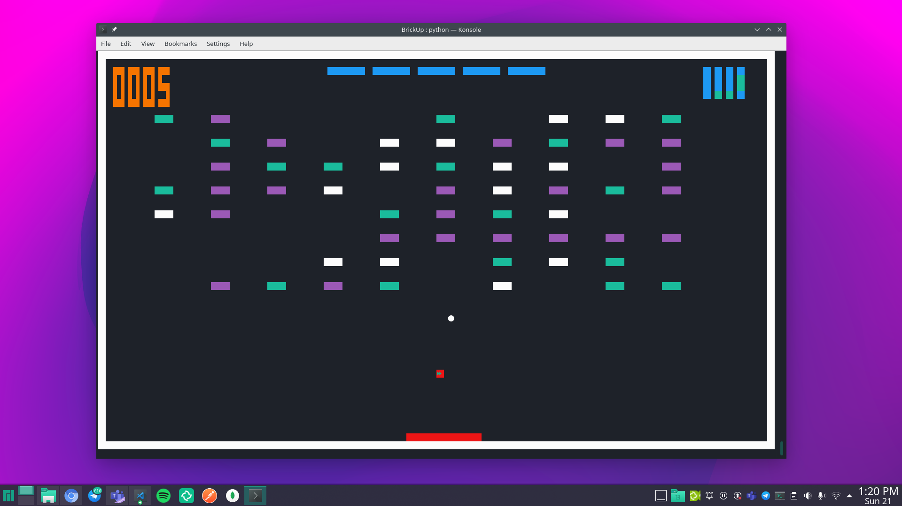

<br />
<p align="center">
  <h1 align="center">BrickUp</h1>
  <p align="center">
    A BrickBreaker clone for terminal lovers.
    <br />
    <a href="https://github.com/ArenaGrenade/BrickUp/issues">Report Bug</a>
    ·
    <a href="https://github.com/ArenaGrenade/BrickUp/issues">Request Feature</a>
  </p>
</p>

<!-- TABLE OF CONTENTS -->
<details>
  <summary><h2 style="display: inline-block">Table of Contents</h2></summary>
  <ol>
    <li>
      <a href="#about-the-project">About The Project</a>
      <ul>
        <li><a href="#built-with">Built With</a></li>
      </ul>
    </li>
    <li>
      <a href="#getting-started">Getting Started</a>
      <ul>
        <li><a href="#prerequisites">Prerequisites</a></li>
        <li><a href="#installation">Installation</a></li>
      </ul>
    </li>
    <li><a href="#contributing">Contributing</a></li>
    <li><a href="#license">License</a></li>
    <li><a href="#contact">Contact</a></li>
  </ol>
</details>

<!-- ABOUT THE PROJECT -->
## About The Project

<p align="center">
  
</p>

A decent looking terminal version of the most-loved BrickBreaker games. It features multiple powerups like - Shrink Paddle, Expand Paddle, Multi-ball, Thru-ball...(I'll keep some for you to discover when you play the game). You have five lives to course through the game and clear all the bricks on which you will win.

There is a tiny binary clock to the side - just to make it harder for you to forget how long you have been playing.. :smile:

### Built With

* [Python](https://www.python.org/)
* [Colorama](https://pypi.org/project/colorama/)
* [Numpy](https://numpy.org/)

<!-- GETTING STARTED -->
## Getting Started

To get a local copy up and running follow these simple steps.

### Prerequisites

You will obviously need Python installed on your computer as the game is itself written in python. For all other liibraries follow the steps under [Installation](#Installation).

* Python - Refer [Official Python Website for installation in your OS](https://www.python.org/downloads/)

### Installation

1. Clone the repo

   ```sh
   git clone https://github.com/ArenaGrenade/BrickUp.git
   cd BrickUp
   ```

2. Install all necessary packages

    ```sh
    pip3 install -r requirements.txt
    ```

3. Run the game and enjoy!

    ```sh
    python main.py
    ```

4. Ping me if you beat the game or just create a PR, I will send you virtual chocolates and add you to the [Brick Breaker Hall of Fame](#Brick-Breaker-Hall-of-Fame) list.

## Brick Breaker Hall of Fame

You could be here. :) Just follow the instructions above.

## About the Code itself

The game is filled with OOPS. Everywhere you look there is OOPS.

The core of the whole game lies inside the `WindowManagement.py` file inside the core direrctory under the game directory. Here the two main thigs are the render thread and the input thread. They are run as two differen threads just so that the input doesn't hog down on the render and physics processing of the game.

The Bricks, Paddle and the Ball are the other components of the game that are present in their own files too. Further every object in the game is inherited from `Component` which is an abstract class.

The `Level` class is built over other Brick classes and it is done in such a way so that the collision system becomes efficient. For every physics update, we will only have to check the collision with four other bricks with the current algorithm. This is a huge speedup over a method that checks each and every brick for collision.

There are other components like the `Score`, `Time` and `Lives` all of which are considered `Number` components and have a certan structure to them.

All other utility functions like - an id generator for the components, collision handlers and other vector operations are under the `utils` directory.

The engine though crude has quite a level of code freedom such that addingg new features would be very straightforward and simple.

## Contributing

Contributions are what make the open source community such an amazing place to be learn, inspire, and create. Any contributions you make are **greatly appreciated**.

1. Fork the Project
2. Create your Feature Branch (`git checkout -b feature/AmazingFeature`)
3. Commit your Changes (`git commit -m 'Add some AmazingFeature'`)
4. Push to the Branch (`git push origin feature/AmazingFeature`)
5. Open a Pull Request

## License

Distributed under the MIT License. See `LICENSE` for more information.

## Contact

Rohan Asokan - [@agentAsskon](https://twitter.com/@agentAsskon) - rohan.asokan@students.iiit.ac.in - [LinkedIn](https://linkedin.com/in/rohan-asokan)
